

# D-Whaler

**超星学习通学习辅助助手**

AI 自动答题 · 后台挂机守护 · 视频倍速与卡顿自愈 · 加密字体解密 · API 花费可视化

**[🌐 在线主页](https://dream-architect1026.github.io/D-Whaler/)** ·
**[⬇️ 脚本猫安装](https://scriptcat.org/zh-CN/script-show-page/8295)** ·
**QQ 群 1128950753**

---

## 📸 运行效果

> 全部为实机截图（v0.5.1 运行画面）。面板为液态玻璃风格，分「状态 / 鲸娘 / 配置 / 引导 / 须知」五页。

| 鲸娘页 · 形象与余额 | 章节测验 · 已答 | 章节测验 · 查询中 |
|:--:|:--:|:--:|
| 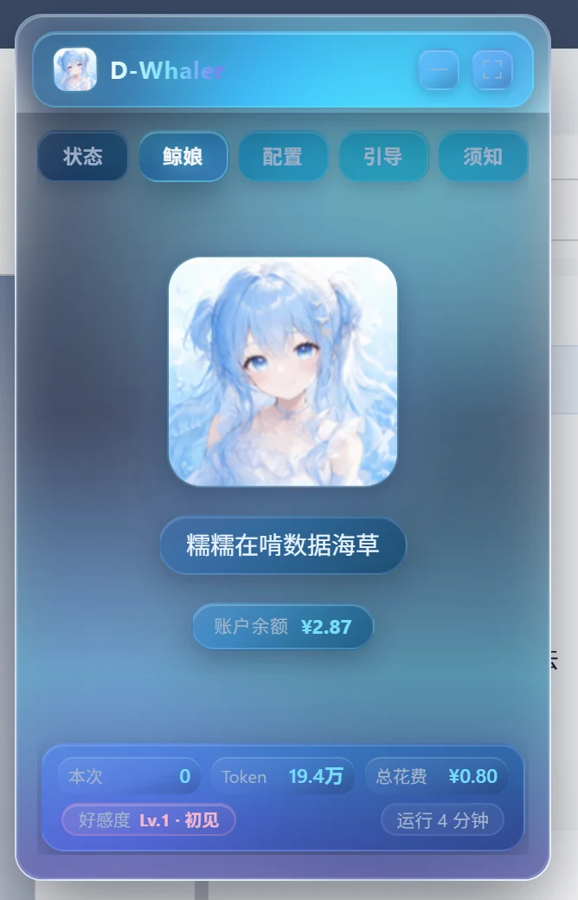 | 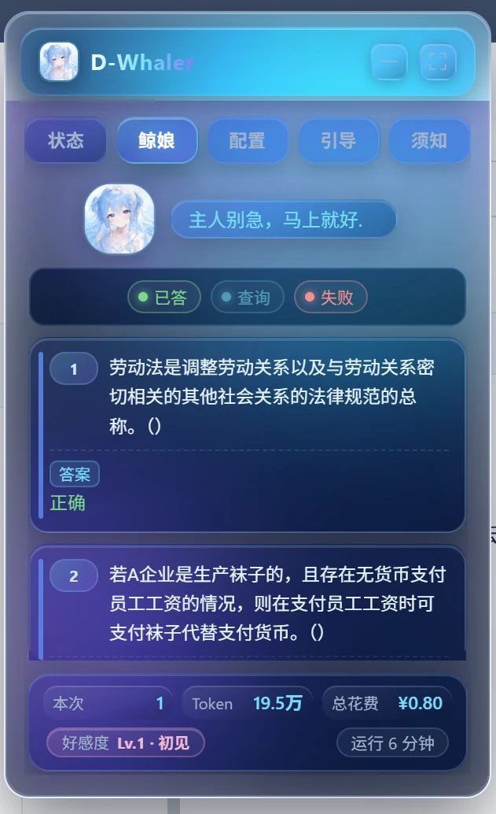 | 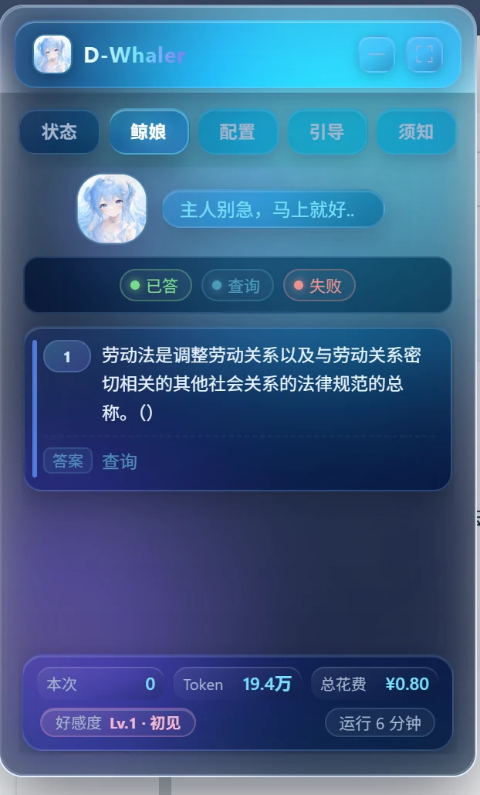 |

| 配置页 · AI 与好感度 | 配置页 · 任务开关 | 引导页 · 填写 API Key |
|:--:|:--:|:--:|
| 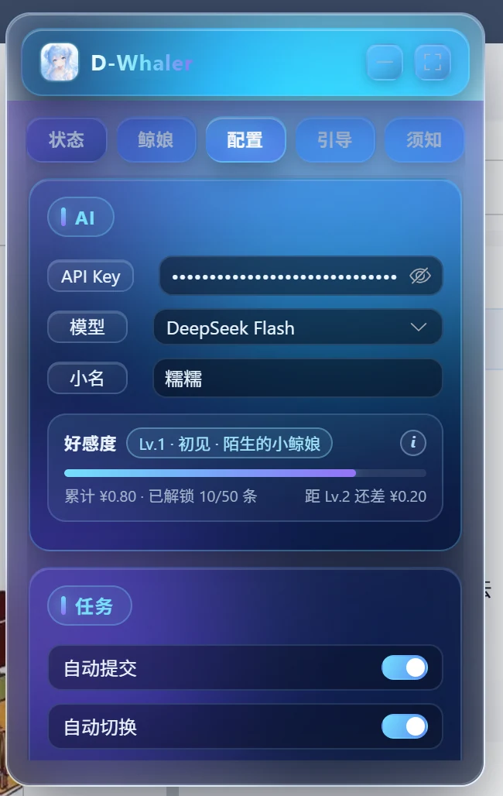 | 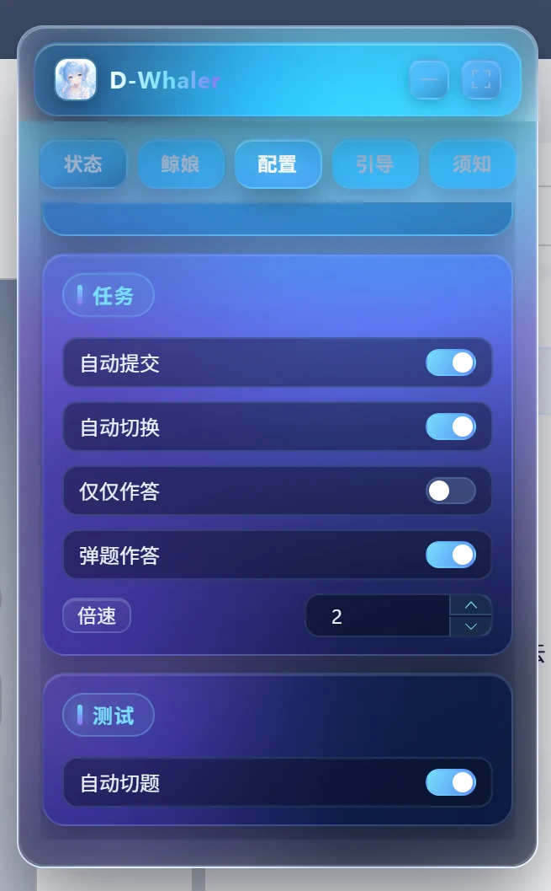 | 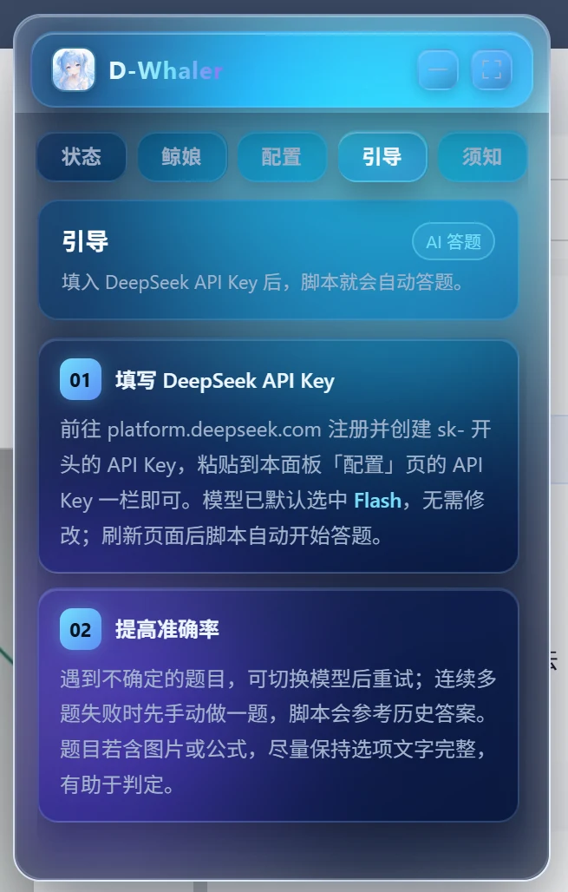 |

| 状态页 · 启动拆解 | 状态页 · 章节推进 | 须知页 · 声明 |
|:--:|:--:|:--:|
| 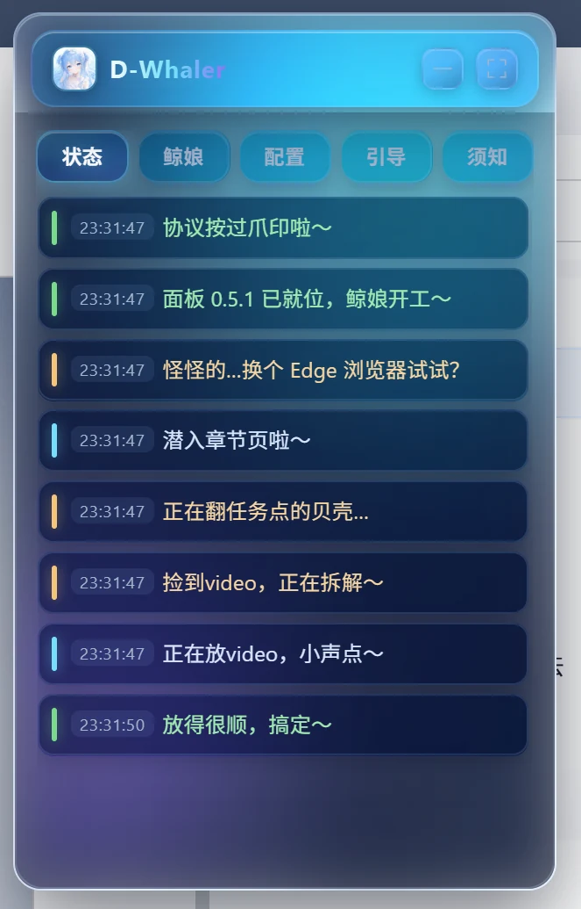 | 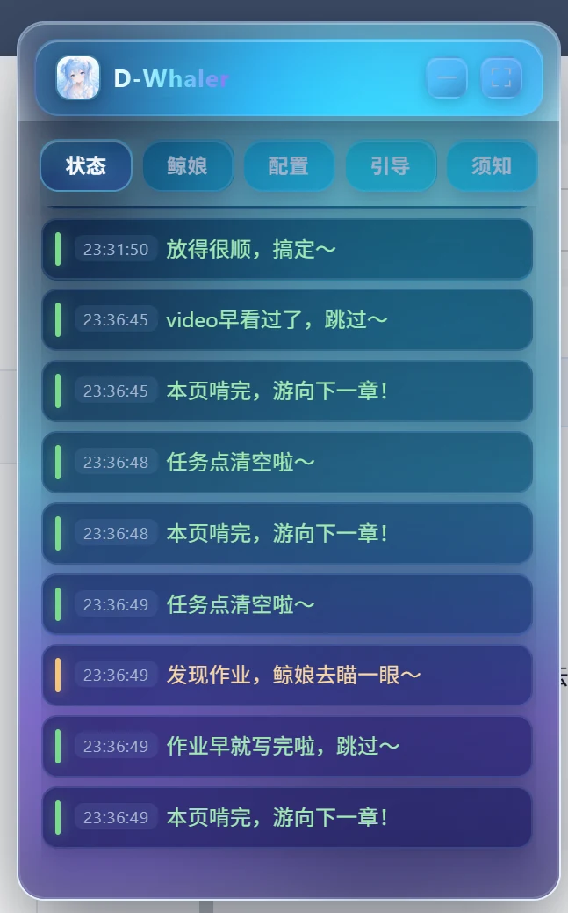 | 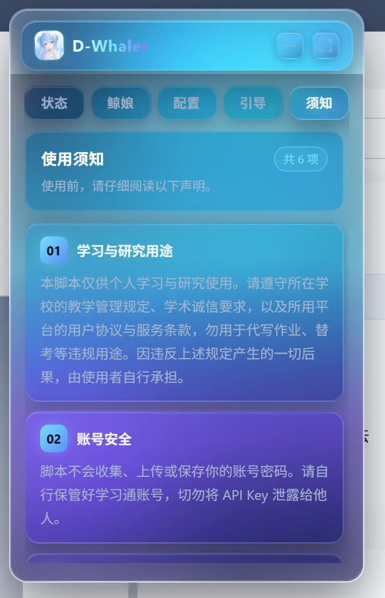 |

更多截图（须知页后半 / 最小化态）

| 须知页 · 05-06 与署名 | 最小化态 · 悬浮胶囊 |
|:--:|:--:|
| 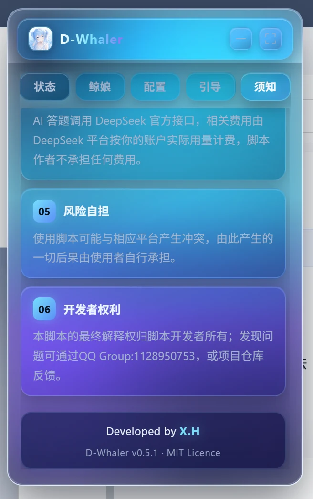 | 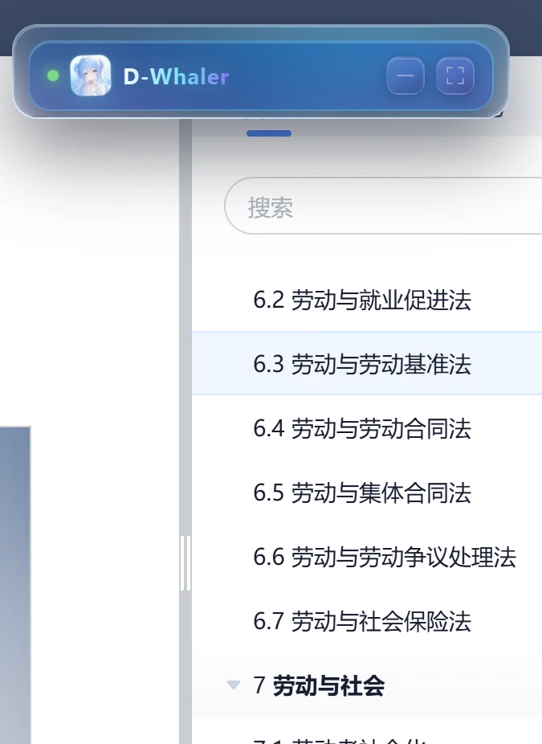 |

---

## ✨ 功能特性

| 模块 | 说明 |
|:--|:--|
| **AI 自动答题** | 接入 DeepSeek（`deepseek-flash` / `deepseek-v4-pro`），覆盖单选、多选、判断、填空等题型 |
| **自动重问** | 一遍答不出来自动重问，**最多 3 遍**；连续失败即跳过该题，不让单题拖死整条流水线 |
| **智能回填** | 答案按**字母索引 + 文本相似度**双通道定位，兼容 `B` / `A,C` / 全角 `Ｂ` 等多种写法 |
| **后台挂机守护** | v0.5.2 新增：可见性恢复补 tick + 20 秒心跳抗冻结 + 定时器自动重建，**浏览器最小化也照跑不误** |
| **视频倍速** | 倍速播放，并处理「答题暂停」场景——暂停中的视频不会被抢播 |
| **卡顿自愈** | 检测到播放器停顿自动戳一下重播 / 播放，触发时在状态页留通知 |
| **文档 / 图书** | 自动完成学习通内的文档与图书任务 |
| **章节作业** | 自动提交，并自动进入下一章节 |
| **PC 端考试** | 支持 PC 端0 学分考试场景 |
| **字体解密** | 自动还原学习通加密字体，复制 / 搜题不再乱码 |
| **用量可视化** | 实时显示 API 请求数、token 数、预估花费与账户余额，点击「本次」格可归零 |
| **缓存计费修正** | v0.5.2：命中 / 未命中 token 改用 API 显式字段，修掉缓存漏记 |
| **状态页即时响应** | v0.5.2：状态词库统一收拢 + 同帧合并派发，状态更新 ≤1 帧 |
| **好感度** | 按**累计花费**分 5 档（初见 → 搭话 → 熟络 → 亲密 → 相伴），每跨一档多解锁 10 条语录，满级共 50 条 |

**成本参考**：刷完一门课程的 token 花销不到 **0.8 元**（取决于题目量与所选模型）。

---

## 📦 安装

推荐使用 **脚本猫（ScriptCat）** 承载：

1. 在 Edge / Chrome 应用商店安装 [脚本猫](https://scriptcat.org/) 扩展。
2. 打开仓库中的 [`D-Whaler.user.js`](D-Whaler.user.js)，点击「安装」；或直接把文件拖进浏览器。
3. 安装后访问学习通课程页面，右下角即出现助手面板。

> 也可使用篡改猴（Tampermonkey）。
> **请勿同时启用多个脚本管理器并重复安装本脚本，以免双注入。**

**运行环境**：脚本目前针对 **Edge** 做了适配，若在其他浏览器出现异常，请优先换 Edge 尝试。

**生效范围**：`chaoxing.com`、`nbdlib.cn`、`hnsyu.net`、`gdhkmooc.com`。
脚本内部按 URL 路由判断（如 `/mycourse/studentstudy`、`/mooc2/work/dowork`、`/exam-ans/exam`），
在非目标页面上不会挂载面板。

**自动更新**：已配置 `@updateURL` / `@downloadURL`，新版本会由脚本管理器自动获取。

---

## ⚙️ AI 配置

1. 前往<https://platform.deepseek.com/> 注册并创建一个 `sk-` 开头的 API Key。
2. 打开助手面板 →「配置」页，粘贴 **API Key** 并选择模型：
   - `deepseek-flash`（默认，性价比高）
   - `deepseek-v4-pro`（更强，单价更高）
3. 刷新课程页面，进入章节测验即可自动逐题作答并填入。

配置仅保存在你本地的脚本管理器存储中，不会上传到任何第三方（AI 接口请求除外）。

---

## 💡 使用说明

- 面板分「**状态**」与「**小鲸**」两页：状态页看运行日志，小鲸页看作答与配置。
- 路由逻辑：答题中留在小鲸页；答题刚结束自动跳到状态页看战果，安静 3 秒后自动切回。
- 建议先在一门课程上小范围验证，再开启「自动提交 / 自动切换」批量运行。
- **用量口径有两套**：「本次」= 本次启用脚本以来，点该格可归零；「累计」= 装好脚本以来一直累加，好感度按累计计算。

---

## ⚖️ 使用须知

使用本脚本即视为完全同意以下声明（共 6 项，面板「须知」页有完整版）：

1. **学习与研究用途** — 仅供个人学习与研究，请遵守所在学校的教学管理规定、学术诚信要求，以及所用平台的用户协议与服务条款，勿用于代写作业、替考等违规用途。
2. **账号安全** — 不收集 / 上传 / 保存账号密码，请勿泄露 API Key。
3. **数据与隐私** — 仅在你主动使用 AI 答题时向 DeepSeek 发送题目与选项文本。
4. **费用与额度** — AI 调用费用由 DeepSeek 按你的账户实际用量计费，作者不承担费用。
5. **风险自担** — 可能与教学系统产生冲突（如触发限流），后果由使用者自行承担。
6. **开发者权利** — 最终解释权归脚本开发者所有。

---

## 💬 加入交流群

遇到问题、想提建议、或者只剩催更，都欢迎进群：**QQ 群 1128950753**

  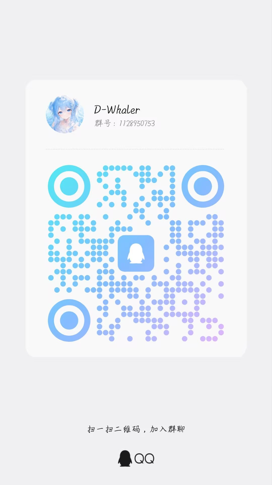

> 反馈 bug 请附上：脚本版本号、浏览器版本、控制台里 `[D-Whaler]` 开头的报错（若有）、复现步骤。

---

## 📄 更新说明

详见 [CHANGELOG.md](CHANGELOG.md)。

---

D-Whaler v0.5.2 · MIT 协议 · 仅供个人学习与研究使用

